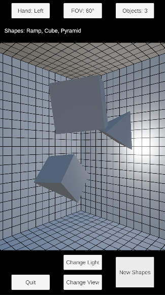

# 立体・光・陰影把握用立体生成アプリ（Random3DShapesForDrawing）

## 概要

立方体型の3D空間内に1から5個の立体をランダムに生成します。光源、カメラの位置はランダムに変更可能です。

## 対象プラットフォーム

Android

## 操作方法

### 上部パネル

- Hand: Left / Right：　下部パネルの「Quit」と「New Shapes」の位置を入れ替えます。
- FOV: 60° / 75° / 90°：　タップで変化。大きくなるほど広い範囲を映します。
- Objects: 1–5：　タップで変化。一度に生成する立体の数です。

### 下部パネル

- Quit：　アプリを終了します。
- Change Light：　光源の位置をランダムに変えます。
- Change View：　カメラの位置をランダムに変えます。
- New Shapes：　立体（群）を生成します。

## 仕様・詳細

### 全体

上部パネルの三項目は切り替えごとにセーブされます。
光源、カメラの位置は保存されません。また、現在表示されている立体も同様に保存の対象外です。

### 立体生成

立体同士は重なりません。
生成・配置判定の仕様により、「Objects」で指定した個数より少なく生成されることがあります。

### 3D空間

一辺5mの立方体で、中心座標は`(x, y, z) = (0, 0, 0)`です。

### 光源

UnityのPoint Lightで距離とともに減衰します。
光源の位置（候補）は、空間を構成している立方体の正方形の面の中心から、空間の中心に向かって0.5m内側にずれた位置です。

### カメラ

UnityのPerspectiveカメラです。
カメラは必ず中央を向きます。

カメラの位置（候補）は、空間の中心との関係では、空間を構成している立方体の正方形の面の中心から、空間の中心に向かって0.1m内側にずれた位置です。
ただし、その他の二つの成分は、`-2.5, -1.25, 0, 1.25, 2.5`のいずれかからランダムに選ばれます。
「斜めから見る」こともできるが完全にランダムではなく一定の規則性がある、という状態にする意図です。

### パース線（グリッド）

空間を構成する立方体の面には、格子状の線が引かれています。

## 立体の種類

生成される立体は15種で、それぞれ等確率で選ばれます。

Arch, Capsule, Cone, Cube, Cylinder, Hexagon, Icosahedron, Octagon, Octahedron, Prism, Pyramid, Ramp, Sphere, Torus, Tube
アーチ、カプセル、円錐、立方体、円柱、六角柱、正二十面体、八角柱、正八面体、角柱、角錐、スロープ、球、トーラス（円環）、チューブ（円筒）
